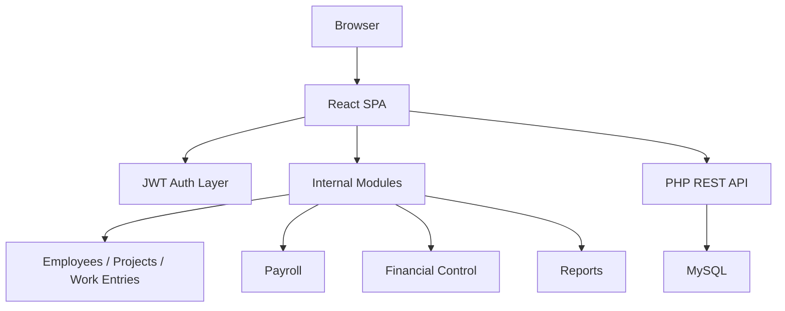

# Nominas Public Showcase

Nominas is a bilingual payroll, weekly timesheet, and labor cost control web application built for US staffing and field-operations workflows.

Live deployment: [nomina.atlantechmarine.com](https://nomina.atlantechmarine.com)

## What I built

Nominas is not a mock dashboard. It is an internal operations system built around real weekly payroll and labor-control workflows.

The implemented product scope includes:

- employee management
- project and contractor management
- weekly timesheet capture
- kiosk/mobile punch entry
- payroll generation
- payroll detail review
- project financial control
- reporting and exports
- role-based access control
- in-app manual and settings

## Why this repository exists

The production implementation for Nominas is not published as an open repository.

This public repository exists as a controlled showcase:

- to demonstrate the product scope and technical architecture
- to show the operational workflows the system supports
- to document the reasoning behind the implementation
- without exposing production credentials, deployment internals, real business data, or the full private source tree

If a recruiter, CTO, or technical evaluator wants deeper review access, that can be granted separately in a controlled context.

## Product snapshot

Nominas is designed for operational payroll workflows where spreadsheet-driven weekly processes become hard to maintain.

It combines:

- employee and contractor management
- project-level assignment tracking
- weekly timesheets
- payroll generation and period detail
- tax configuration
- project financial control
- KPI dashboards and exportable reports
- role-based access control

## Main modules

The private implementation currently includes dedicated modules for:

- `Dashboard`
- `Employees`
- `Projects`
- `Weekly Timesheets`
- `Kiosk Punch / Time Punches`
- `Payroll`
- `Financial Control`
- `Reports Hub`
- `Settings`
- `User Manual`

This is based on the actual routed application structure in the working product, not on a conceptual roadmap.

## Why it matters

This is not just an HR CRUD.

Nominas solves a real operational problem:

- weekly labor data must be captured fast
- payroll and project cost control must stay aligned
- reporting must reduce manual reconciliation work
- the system must stay simple enough to run in a pragmatic hosting environment

## Technical snapshot

- Frontend: `React 18`, `Vite`, `TailwindCSS`
- Backend: `PHP REST API`
- Database: `MySQL`
- Auth: `JWT`
- Hosting model: shared-hosting deployment with build + sync workflow
- Key focus areas: payroll workflows, financial visibility, reporting, RBAC, pragmatic operability

## Selected capabilities

- weekly salary report flow replacing spreadsheet-heavy operations
- payroll generation and pay-period detail
- project financial control by week
- contractor/division grouping
- multiple exportable reports
- admin / supervisor / viewer roles
- bilingual internal workflow support

## Route and module evidence

The implemented application shell currently exposes route groups for:

- `/dashboard`
- `/employees`
- `/projects`
- `/timesheets`
- `/time-punches`
- `/payroll`
- `/financials`
- `/reports`
- `/settings`
- `/manual`
- kiosk punch aliases such as `/reloj`, `/fichar`, and `/kiosk/punch`

These routes are backed by concrete frontend modules in the private implementation.

## Selected workflow areas

- weekly salary capture
- payroll calculation
- financial control and requested vs paid tracking
- dashboard visibility for operations
- reporting and exports

## Workflow evidence

The product is documented around real workflow areas, not generic admin abstractions:

- weekly salary report workflow
- financial control workflow
- deployment and bootstrap workflow
- API route surface
- database structure
- UI shell and layout system

See:

- [Architecture](./docs/architecture.md)
- [Workflow Map](./docs/workflows.md)
- [Feature Map](./docs/feature-map.md)
- [Documentation Map](./docs/documentation-map.md)

## Architecture overview

## Public evaluation guide

If you are reviewing this project, the fastest way to evaluate it is:

1. Read the product summary in this README.
2. Review the architecture snapshot in [docs/architecture.md](./docs/architecture.md).
3. Review the workflow framing in [docs/workflows.md](./docs/workflows.md).
4. Review the module and feature summary in [docs/feature-map.md](./docs/feature-map.md).
5. Treat this repository as a portfolio layer, not as the full production codebase.

## Repository strategy

This repository is intentionally not the full source repository.

The source-of-truth implementation stays outside the public showcase because the private version contains:

- deployment-sensitive files
- environment-specific backend configuration
- real workflow documents
- real or example operational spreadsheets
- setup/bootstrap endpoints that should not be broadly exposed

## Review access

If you want deeper technical review access, contact me through:

- GitHub: [Robertgaraban](https://github.com/Robertgaraban)
- LinkedIn: [linkedin.com/in/robertgaraban](https://www.linkedin.com/in/robertgaraban)

## Notes

- This repository is published for portfolio, evaluation, and technical review purposes only.
- It is not an open-source release of the full production system.
- See [docs/public-scope.md](./docs/public-scope.md), [docs/repo-strategy.md](./docs/repo-strategy.md), [docs/closeout.md](./docs/closeout.md), and [NOTICE.md](./NOTICE.md).
