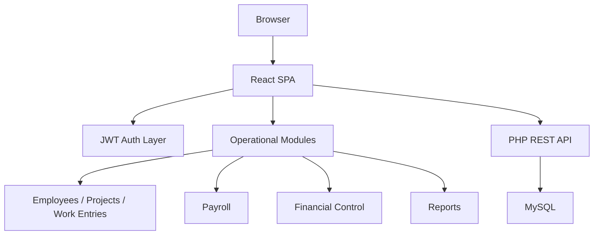

# Nominas Technical Brief

Nominas is a private internal system for payroll operations, weekly labor capture, and project-level financial control.

This repository is the public technical brief for the system. It exists to make the product scope, architecture, and publication boundary reviewable without exposing the private source tree or operational data.

Live deployment: [nomina.atlantechmarine.com](https://nomina.atlantechmarine.com)

## At a glance

- Status: `live in production`
- System type: `internal operations platform`
- Domain: `payroll`, `weekly timesheets`, `field punch`, `project financial control`, `reporting`
- Roles: `admin`, `supervisor`, `viewer`
- Stack: `React 18`, `Vite`, `TailwindCSS`, `PHP REST API`, `MySQL`, `JWT`
- Deployment model: `pragmatic shared-hosting runtime with build + sync workflow`
- Publication model: `public technical brief, private implementation`

## Problem domain

Nominas was built for a workflow-heavy environment where payroll and labor control were being managed through recurring spreadsheet processes.

The system is designed to reduce manual reconciliation across:

- employee and project setup
- weekly salary capture
- payroll generation
- project financial tracking
- reporting for operations and management

This is not a public SaaS product and it is not intended to be evaluated as a design-only admin panel.

## Publication boundary

This repository is intentionally not a public code release.

The implementation remains private because the working system contains:

- deployment-sensitive files
- environment-specific backend wiring
- setup/bootstrap paths
- real workflow artifacts derived from operational spreadsheets
- internal documentation tied to the live environment

That boundary is deliberate. In a system that handles payroll-adjacent workflows, field punch data, and internal financial tracking, a serious publication posture is to expose architecture and scope while keeping runtime-sensitive material private.

## Routed surface inventory

The live system resolves through a SPA shell. These routes are part of the working application surface:

- App entry / login shell: [nomina.atlantechmarine.com](https://nomina.atlantechmarine.com)
- Kiosk punch route: [nomina.atlantechmarine.com/reloj](https://nomina.atlantechmarine.com/reloj)
- Dashboard: [nomina.atlantechmarine.com/dashboard](https://nomina.atlantechmarine.com/dashboard) `auth required`
- Weekly timesheets: [nomina.atlantechmarine.com/timesheets](https://nomina.atlantechmarine.com/timesheets) `auth required`
- Payroll: [nomina.atlantechmarine.com/payroll](https://nomina.atlantechmarine.com/payroll) `auth required`
- Financial control: [nomina.atlantechmarine.com/financials](https://nomina.atlantechmarine.com/financials) `auth required`
- Reports hub: [nomina.atlantechmarine.com/reports](https://nomina.atlantechmarine.com/reports) `auth required`
- User manual: [nomina.atlantechmarine.com/manual](https://nomina.atlantechmarine.com/manual) `auth required`

For the route-by-route interpretation, see [Live Tour](./docs/live-tour.md).

## Operational scope

The implemented system includes:

- employee management
- project and contractor management
- weekly timesheet capture
- mobile kiosk punch entry
- payroll generation and payroll detail review
- project financial control
- operational reports and exports
- role-based access control
- embedded user guidance

The strongest functional areas are:

- the weekly salary report flow modeled from real spreadsheet usage
- the financial-control layer that tracks requested, paid, and remaining amounts by project/week
- the field-oriented kiosk flow with GPS and nearest-project logic

## Main modules

The private implementation currently exposes dedicated routed modules for:

- `Dashboard`
- `Employees`
- `Projects`
- `Weekly Timesheets`
- `Kiosk Punch / Time Punches`
- `Payroll`
- `Financial Control`
- `Reports Hub`
- `Settings`
- `User Manual`

This module list is based on the working route structure, not on a conceptual roadmap.

## Architecture summary

- Frontend: authenticated `React SPA`
- API: `PHP REST API`
- Database: `MySQL`
- Auth model: `JWT`
- Data focus: employees, projects, assignments, work entries, payroll periods, contractor/division records, financial control rows and adjustments

High-level architecture:

See [Architecture](./docs/architecture.md) for the fuller snapshot.

## Technical decisions

### 1. Workflow-first domain model

The product is shaped around the weekly operating cycle, not around generic CRUD completeness.

That means:

- worker/project setup exists to support weekly capture
- weekly capture feeds payroll
- payroll and labor totals feed financial control
- reporting sits on top of those operational layers

### 2. Pragmatic stack choice

`React + PHP + MySQL` was chosen as an operationally pragmatic stack for a real internal product.

The goal here is not infrastructure theater. The goal is:

- understandable deployment
- maintainable internal workflows
- enough flexibility to evolve reporting and payroll logic
- low friction for a hosted production environment

### 3. Reporting as a first-class layer

The system includes multiple report paths because the core problem is not only data entry. It is operational visibility and reconciliation.

### 4. Controlled publication model

The public repository is documentation-first by design. For this type of system, exposing architecture and module inventory is appropriate. Exposing production-like datasets, screens, or code paths broadly is not.

## Evidence package

This repository provides evidence in four forms:

- routed surface inventory via [Live Tour](./docs/live-tour.md)
- architecture summary via [Architecture](./docs/architecture.md)
- workflow documentation via [Workflows](./docs/workflows.md)
- module and documentation maps via [Feature Map](./docs/feature-map.md) and [Documentation Map](./docs/documentation-map.md)

It also points to the live deployment for shell-level verification, while keeping protected application use behind authentication.

## Evaluation protocol

If you are reviewing this project as a recruiter, CTO, or technical lead:

1. Read this README as the system brief.
2. Review [Live Tour](./docs/live-tour.md) to understand the routed surface.
3. Review [Architecture](./docs/architecture.md).
4. Review [Workflows](./docs/workflows.md).
5. Review [Feature Map](./docs/feature-map.md).
6. Treat this repository as a due-diligence layer, not as the public source distribution.

## Controlled review access

If deeper review is needed, the appropriate model is controlled access to the private implementation, not broader public publication.

Contact:

- GitHub: [Robertgaraban](https://github.com/Robertgaraban)
- LinkedIn: [linkedin.com/in/robertgaraban](https://www.linkedin.com/in/robertgaraban)

## Notes

- This repository is a technical brief and portfolio layer.
- It is not an open-source release of the production system.
- See [docs/public-scope.md](./docs/public-scope.md), [docs/repo-strategy.md](./docs/repo-strategy.md), [docs/closeout.md](./docs/closeout.md), and [NOTICE.md](./NOTICE.md).
